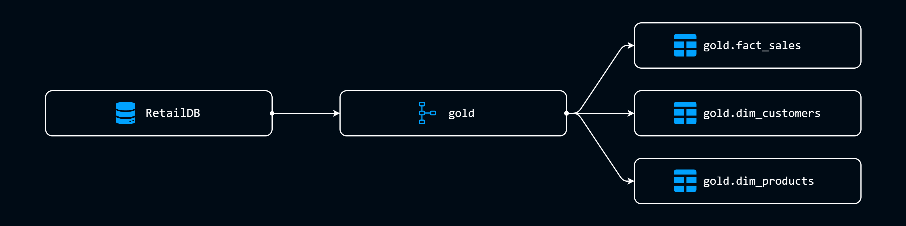

# Retail Data Analytics: EDA + Advanced Analytics for a Retail Chain

Welcome to the Retail Data Analytics Project 🚀

This is a **Full Stack Data Analysis** Project for a Retail Chian. This project consists of **EDA** along with **Advance Analytics** to generate reports for creating **BI Dashboards**

This project is build upon fictional retail data generated by **LLMs** based on **Real Life Business Scenerios** and underwent a complete **ETL Process**

---

## Project Overview 🪛

Analyse and Create Reports for a retail chain to answer business questions and provide insights into future desicion making. This include in depth analysis and generating answers for all the existing business questions.

The Processes:

- **Exploratory Data Analysis:** Explore the Database to understand all structure and basic details regarding the content
  
- **Advanced Analytics:** Use advance methods to form coplex calculations and generate insights for reports

---

## Data Architecture 📐

The Source data for this project is the Database **RetailDB** which has be constructed as part of the [Data Warehouse Project](https://github.com/abhijithsnair1111/Retail-Data-Warehouse-Project.git).

The Architecture for this project consists of the main Database **RetailDB**. The main Schema inside the database named **Gold** is made up of one **Fact** table and two **Dimension** tables

- Fact Table  - Sales Details `gold.fact_sales`
  
- Dimension Table - Customer Details `gold.dim_customers`

- Dimension Table - Products Details `gold.dim_products`

[**Data Catalog**](docs/data_catalog.md) provides a detailed breakdown of the tables and columns inside the tables

---

## Analysis 📈

The first part of this project is **Data Analysis**. Exploring and Understanding the data to extract patterns, and futher manupulating it using advance methods form complex results  
Thus the entire process is split into two parts

- **Exploratory Data Analysis (EDA)**
  
- **Advanced Analytics**

Each stage is further dived into six parts focusing on a specific action respective to the process

### Exploratory Data Analysis
The purpose of doing an initial EDA for this project is to develop an basic understanding about the structure and various relations that make up the tables.  

- **Database Exploration**
  - Purpose: Explore the structure of the Database. Understand the Tables and thier Schemas, explore all the Columns and its metadata
  - Script: [`database_exploration`](scripts/database_exploration.sql)
  - Insights: How the Schema, Tables and Columns inside the Database are structured

- **Dimensions Exploration**
  - Purpose: Explore the Dimensional values inside the tables. Understand the cardinality of such values for future categorization
  - Script: [`dimensions_exploration`](scripts/dimensions_exploration.sql)
  - Insights: All the unique Countries in which the customers belong to, All the different Categories, Subcategories and Products Names

- **Measures Explorations**
  - Purpose: Explore the Measure values inside the table. Understand the basic aggregations that can be performed on the measures
  - Script: [`measures_exploration`](scripts/measures_exploration.sql)
  - Insights: Generated a basic report regarding all the key metrics of the sales (Sales, Orders, Quantity, Price , Products and Customers)
 
- **Date Exploration**
  - Purpose: Explore the Date range of several important date values.
  - Script: [`date_exploration`](scripts/date_exploration.sql)
  - Insights: Extacted the first and last Order Date and the months in between them, Extracted the oldest and youngest customer
 
- **Magnitude Analysis**
  - Purpose: Understand data dstributions across categories. Group measures by dimensions
  - Script: [`magnitude_analysis `](scripts/magnitude_analysis.sql)
  - Insights: Extracted several aggregations by categoreis such as Total Customers by Countries/Gender, Total Produts by Categories
    
- **Ranking Analysis**
  - Purpose: To rank different dimensions according to various measures. Find out the top or bottom performers
  - Script: [`ranking_analysis`](scripts/ranking_analysis.sql)
  - Insights: Extracted Top and Bottom performing products and customers, products based on their performance, customers based on their purchase

### Advanced Analytics
The purpose of the Advanced Analytics is to understand the data in depth by forming complex calcultions to extract insight and generate comprehensive reports

- **Change Over Time Analysis**
  - Purpose: Track trends, growth and chages in key values over time. Understand performance of over time
  - Script: [`change_over_time_analysis`](scripts/change_over_time_analysis.sql)
  - Insights: Analysed Sales performance over time
 
- **Cumulative Analysis**
  - Purpose: Calculate Running Totals ans Moving Averages of key values. Performance over time cumulatively
  - Script: [`cumulative_analysis`](scripts/cumulative_analysis.sql)
  - Insights: Caculated Running Total Sales and Moving Average Prices
 
- **Performance Analysis**
  - Purpose: Calculate the Performace of a metrics by itself over time. Year Over Year analysis
  - Script: [`performance_analysis`](scripts/performance_analysis.sql)
  - Insights: Calculated each product performance compared to the average product sales and the previous year sales
 
- **Part To Whole Analysis**
  - Purpose: Calculate the proportion of a metric in a given category compared to the whole aggragated value
  - Script: [`part_to_whole_analysis`](scripts/part_to_whole_analysis.sql)
  - Insights: Calculated how much each category contributed to the overall sales
 
- **Data Segmentation Analysis**
  - Purpose: Group data into meaningful categories based on a specific metric
  - Script: [`data_segmentation_analysis`](scripts/data_segmentation_analysis.sql)
  - Insights: Segemented products into cost ranges and counted the number of products in each segment

- **Reports**
  - All the above analysis are summarized a single report for both the **Customers** and the **Products** to created a detailed report on all the important metrics and calculations
  - Script: [`customer_report`](scripts/customer_report.sql) and [`product_report`](scripts/product_report.sql)
  - Sample: Customer Report
    | customer_key | customer_number | customer_name | customer_age | customer_age_group | customer_segment | lifespan | last_order | recency_in_months | total_orders | total_sales | total_quantity | total_products | avg_order_value | monthly_spend |
    | --- | ---        | ---               | --- | ---   | --- | --- | ---        | --- | --- | ---  | --- | --- | ---  | --- |
    | 1   | AW00011000 | Jon Yang          | 55  | 40-59 | VIP | 28  | 2013-05-03 | 152 | 3   | 8249 | 8   | 8   | 2749 | 294 |
    | 2   | AW00011001 | Eugene Huang      | 50  | 40-59 | VIP | 35  | 2013-12-10 | 145 | 3   | 6384 | 11  | 10  | 2128 | 182 |
    | 3   | AW00011002 | Ruben Torres      | 55  | 40-59 | VIP | 25  | 2013-02-23 | 155 | 3   | 8114 | 4   | 4   | 2704 | 324 |
    | 4   | AW00011003 | Christy Zhu       | 53  | 40-59 | VIP | 29  | 2013-05-10 | 152 | 3   | 8139 | 9   | 9   | 2713 | 280 |
    | 5   | AW00011004 | Elizabeth Johnson | 47  | 40-59 | VIP | 28  | 2013-05-01 | 152 | 3   | 8196 | 6   | 6   | 2732 | 292 |
    
  - Sample: Product Report
    | product_key | product_number | product_name | category | subcategory | cost | product_segments | lifespan | last_sale_date | recency_in_months | total_orders | total_sales | total_quantity | total_customers | avg_selling_price | avg_order_revenue | avg_monthly_revenue |
    | --- | ---        | ---                      | ---        | ---            | ---  | ---            | --- | ---        | --- | --- | ---     | --- | --- | --- |  ---  | ---    |
    | 3   | BK-M82B-38 | Mountain-100 Black- 38   | Bikes      | Mountain Bikes | 1898 | High Performer | 11  | 2011-12-27 | 169 | 49  | 165375  | 49  | 49  | 3375 | 3375 | 15034  |
    | 4   | BK-M82B-42 | Mountain-100 Black- 42   | Bikes      | Mountain Bikes | 1898 | High Performer | 11  | 2011-12-27 | 169 | 45  | 151875  | 45  | 45  | 3375 | 3375 | 13806  |
    | 5   | BK-M82B-44 | Mountain-100 Black- 44   | Bikes      | Mountain Bikes | 1898 | High Performer | 11  | 2011-12-21 | 169 | 60  | 202500  | 60  | 60  | 3375 | 3375 | 18409  |
    | 6   | BK-M82B-48 | Mountain-100 Black- 48   | Bikes      | Mountain Bikes | 1898 | High Performer | 12  | 2011-12-26 | 169 | 57  | 192375  | 57  | 57  | 3375 | 3375 | 16031  |
    | 7   | BK-M82S-38 | Mountain-100 Silver- 38  | Bikes      | Mountain Bikes | 1912 | High Performer | 12  | 2011-12-22 | 169 | 58  | 197200  | 58  | 58  | 3400 | 3400 | 16433  |

---

## Business Questions & Insights 🔎
This project started as a means to answers business question regarding the nature of the retail data. Some of the  most relevant questions and the answers that could be answered from this project are:

- What is the overall sales performance of the retail chain over the last 5 years ?
  - The overall sales perfromance of the retail chain has be fluctuating through out the last 5 years

    | Year  | Sales     |
    |---    |---        |
    | 2010  | 43419     |
    | 2011  | 7075088   |
    | 2012  | 5842231   |
    | 2013  | 16344878  |
    | 2014  | 45642     |

- Which age group of customers generate the most revenue for the business ?
  - The customers with age 50 to 59 generate the most revenue for the business
      
    | Customer Age Group | Sales    |
    |---                 |---       |
    | 50 - 59            | 10578347 |
    | 40 - 49            | 8664719  |
    | 60 - 69	           | 6489920  |
    | 70 - 79	           | 2823237  |
    | 80 and Above	     | 795035   |

- Which category of products generate the most revenue for the company in percentage ?
  - The category 'Bikes' generate the most revenue for the company
    
    | Category    | Sales by Category | Total Sales | Percentage |
    |---          |---                |---          |---         |
    |Bikes        | 28311657          | 29351258	  | 96.46%     |
    | Accessories	| 699909	          | 29351258	  | 2.38%      |
    | Clothing	  | 339692	          | 29351258	  | 1.16%      |

    This could adversely affect the company as disruption in bike sales could reduced the revenue considerably

---

## Project Requirements 📋
The entire project was constructed on top of  certain requirements and by the end of the Analysis all of them are fulfilled

- [x] Connect to the source Database **RetailDB** to access all the necessary data for the project

- [x] Define the Data Architecture of the project by understanding the structure of the Database

- [x] Perform **Exploratory Data Analysis** on the tables to understand basic information about the data

- [x] Perform **Advanced Analytics on the data to extract in depth information through complex calculations

- [x] Create two reports each for the **Customers** and **Products** to be used in future Reportings

- [x] Check whether the Analysis answers business questions and provide insights

- [x] Provide clear documemtation reagarding the entire process in a easy to acess format

---

## Tech Stack 🔧

- **Language:** SQL (TSQL)
- **Server:** Microsoft SQL Server
- **Database:** RetailDB
- **Processes:** EDA, Advanced Analytics

---

This entire project is Part Two of the **Data Warehouse, Data Analysis and BI Reporting Project** split into [**Data Warehouse Project**](https://github.com/abhijithsnair1111/Retail-Data-Warehouse-Project.git) and [**Data Analytics Project**](https://github.com/abhijithsnair1111/Retail-Data-Analytics-Project) and **PowerBI Reporting Project**

Thank You visiting the Retail Data Analytics Project 🚀

---

